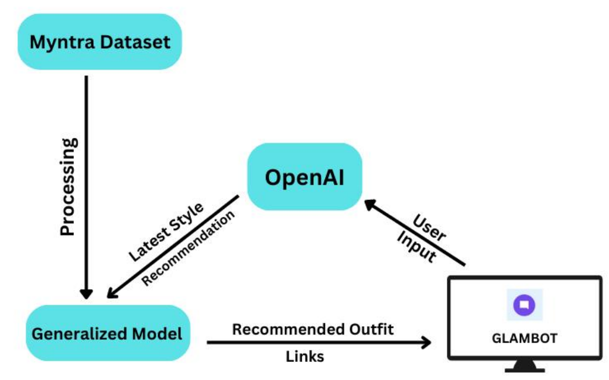

# GlamBot -  Conversational Outfit Generator Powered by GenAI 
Introducing Glambot, your personal fashion companion designed to revolutionize the way you approach style. 
Are you often faced with the daunting task of piecing together a fashionable ensemble? Look no further. Glambot is here to effortlessly guide you through the process, offering an array of trendy outfit ideas curated just for you. Say goodbye to the overwhelming sea of options while shopping online; Glambot streamlines your experience, presenting you with carefully selected fashion suggestions and direct links for seamless purchases. Moreover, if you've ever struggled to define your personal style, Glambot has you covered. By understanding your unique preferences, it tailors outfit recommendations that resonate with your individual style identity, making the journey towards sartorial self-expression a breeze. Say hello to a world where fashion is at your fingertips, with Glambot leading the way.

Languages and Libraries used : Python, OpenAI, Flask, Pandas, NLTK (Natural Language Toolkit), Gensim, NumPy, scikit-learn
Dataset Link - []()
Workflow:


### To run the application, follow the following steps

* Step 1 
Install all the requirements 
```
pip install -r requirements.txt
``` 

* Step 2 
Run all cells of Preprocessing-model.ipynb to generate and save the model 

* Step 3 
Run app.py 
```
python app.py
```

* Step 4
Use the chatbot by clicking on the webpage generated. 


